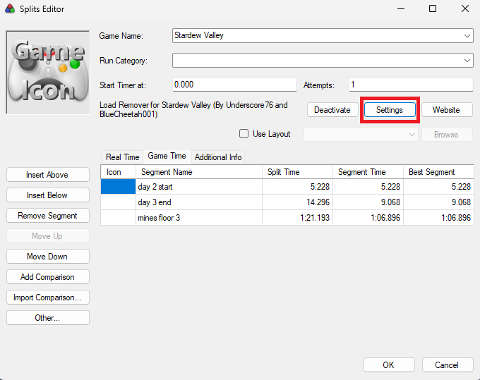
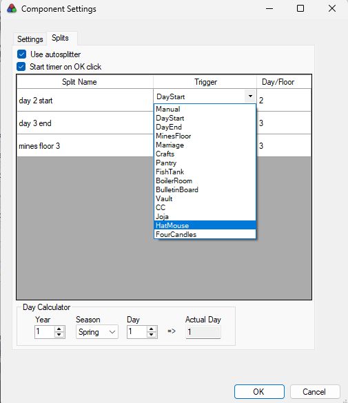

# AutoSplitter Setup

Built by [Underscore76](https://github.com/Underscore76), for install instructions of the loader remove go [here](loadremover.md).

As part of the LiveSplit plugin, you'll get a settings page where you can customize your split configuration. Head to `Edit Splits` in LiveSplit and click the Settings tab

Once there click the `Splits` tab at the top of this menu.

Here you'll see your defined splits and options for setting what should trigger the split. **NOTE: You need to check the "Use Autosplitter" checkbox for this to work. Additionally you can set whether you want the timer to start after clicking the OK button on character creation. For things like Multiplayer you may want to avoid this setting if you are doing a pause start.**

Once setup it should *Just Work*. At least *it works on my machine...* For troubleshooting see [below](#troubleshooting)

## Options
There are a number of triggers you can set for your splits. **If you manually split over an automated trigger or revert/skip a split**, all bets are off on downstream splits (the autosplitter recognizes you have manually acted and will in most cases cease functioning for the remainder of that run).

### Manual Control
* **Manual**: you have to manually split this, this can be useful if you have a point in your run that is not covered by another trigger.

### Has Required Setting
* **DayStart**: will split at the start of the day on the specified day, there is a calculator at the bottom to work out season/year day (it must be a single value so Y2 Spring 28 = day 140)
* **DayEnd**: will split at the end of the day on the specified day, there is a calculator at the bottom to work out season/year day (it must be a single value so Y2 Spring 28 = day 140)
* **MinesFloor**: will split upon reaching the specified floor in the mines. May split slightly off depending on numerous factors for floor load

### CC Rooms
Splits on the end of the cutscene for the specific room at the flash.
* **Crafts**
* **Pantry**
* **FishTank**
* **BoilerRoom**
* **BulletinBoard**
* **Vault**

### Restoration
* **CC**: splits on the final cutscene for the Community Center at the flash. If you are animation canceling and stacking cutscenes, it may split early as the cutscenes overlap.
* **Joja**: splits on the lift of the Joja vending machine.

### Others
* **Marriage**: splits at the heart in the marriage cutscene
* **HatMouse**: splits upon talking to the hatmouse
* **FourCandles**: splits at the point where the candles appear in the cutscene (assuming you have 4).

**GENERAL NOTE**: End times given by the autosplitter may not be perfectly accurate. We strive to retime all runs so don't worry if it's off by a little, we'll correct as needed.

## Troubleshooting

* "Hey sometimes the timer just starts while I'm on the character creation screen?" - This is a well known issue, though I have never once been able to re-create this bug on my machine (let alone in an environment where I can diagnose the problem). Just imagine I'm helping pad your total runs stats.
* "It stopped working mid run" - could happen for a few reasons:
    * LiveSplit disconnected from the game process... not a lot we can do in this case. The timer should still run at least, but splits will likely all revert to manual.
    * You manually skipped/reverted/split a non-manual trigger. In this case, the autosplitter may stop working to avoid interferring further (like if you are audibling a run, rerouting on the fly and your splits dont matter, etc)
* "Just doesn't want to work at all" - check that your game version/selected trigger is supported [here](https://github.com/Underscore76/LiveSplit.StardewValley?tab=readme-ov-file#getting-started). Sometimes you'll just need to restart LiveSplit, it can sometimes behave weirdly or fail to connect to the game.
