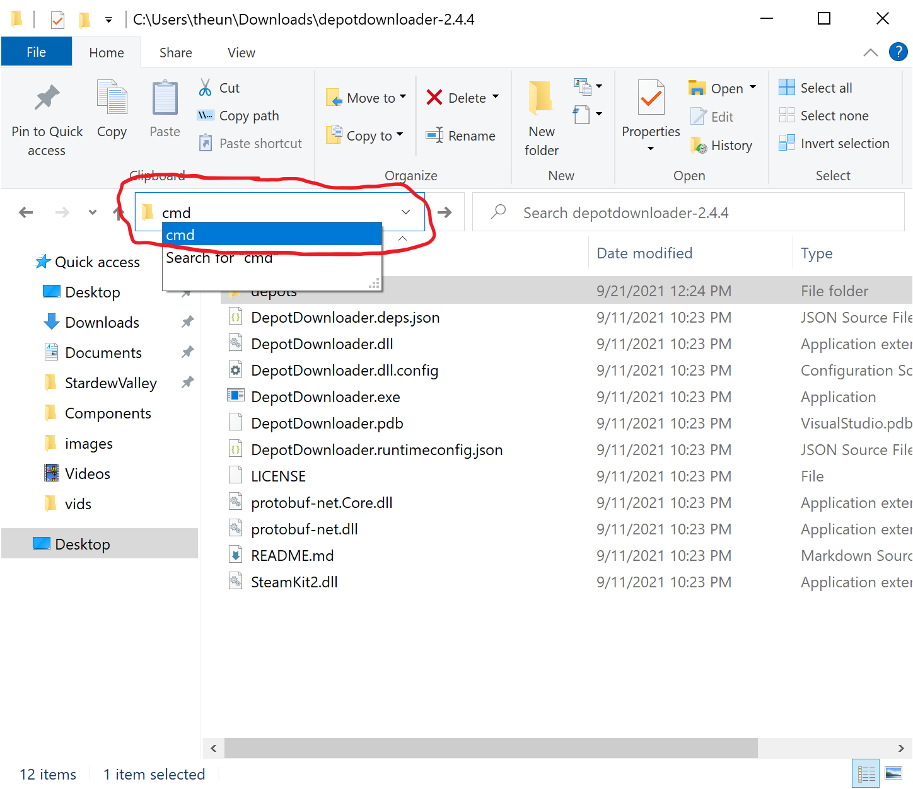
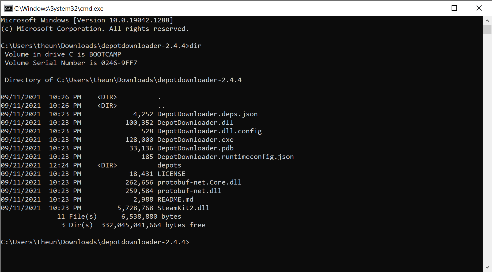

# Downpatching

## Manifest IDs

These IDs can be found by going to the Stardew Valley page on steamdb https://steamdb.info/depot/413151/manifests/

Specific verion values

- 1.0 - 3352391531516945586
- 1.1 - 7487215307508292747
- 1.2.33 - 5793210319202900873
- 1.3.36 - 3080804457574934302
- 1.4.0 - 2373680906867811602
- 1.4.5 - 6307986820908740561
- 1.5.4 - 7802000804251603756

## Get the Depot Downloader

DepotDownloader is a tool for pulling legacy versions of your games from steam, which you can find [here](https://github.com/SteamRE/DepotDownloader/releases). Download the zip file and expand it wherever.

Open the folder you extracted the zip into and then type `cmd` into the address bar (clear the original contents):



Press enter and this will open a command prompt at this location. You can type `dir` to see the files/make sure you're at the right spot (you want to see `DepotDownloader.exe` in the file list)



Then you'll want to run the following command.

### **IF YOU ARE TRYING TO GET SUPPORT WITH THIS, DONT BE DUMB AND SHOW SOMEONE YOUR PASSWORD**

```
DepotDownloader.exe -app 413150 -depot 413151 -manifest PUTMANIFESTIDHERE -username PUTUSERNAMEHERE -password PUTPASSWORDHERE
```

Filling in the value for the manifest from above, as well as your username/password. If you have setup MFA, it will ask you for your MFA token to complete authentication.

For reference, 413150 is the APP ID for Stardew Valley, and 413151 is the DEPOT ID for Windows (413152 is for MacOS, 413153 is for Linux).

## Cool, it's downloading now what?

This will trigger the game to download the requested version to the `depots` folders. You'll likely want to copy the download out of this folder as trying to pull a new version will overwrite whatever is in this folder.

---

And that's it, if you have questions please reach out on the Stardew Speedrun Discord ([https://discord.gg/2zsuVzjAhN](https://discord.gg/2zsuVzjAhN))
