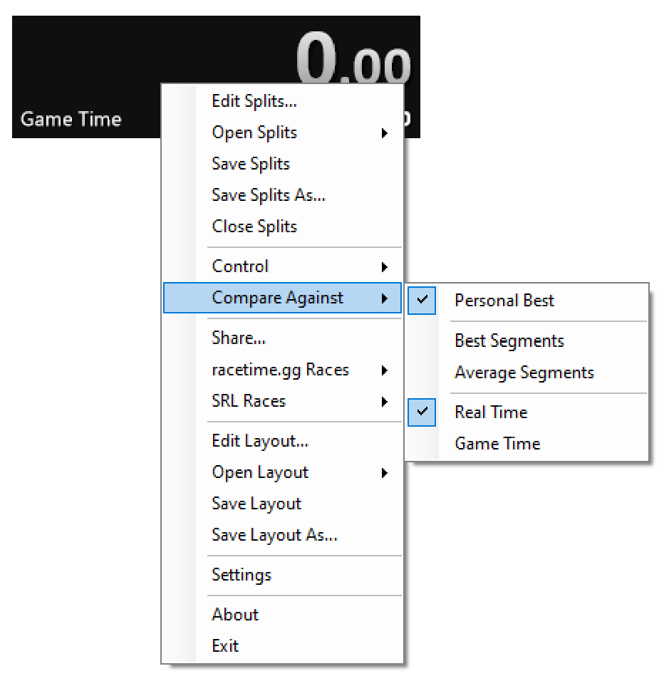
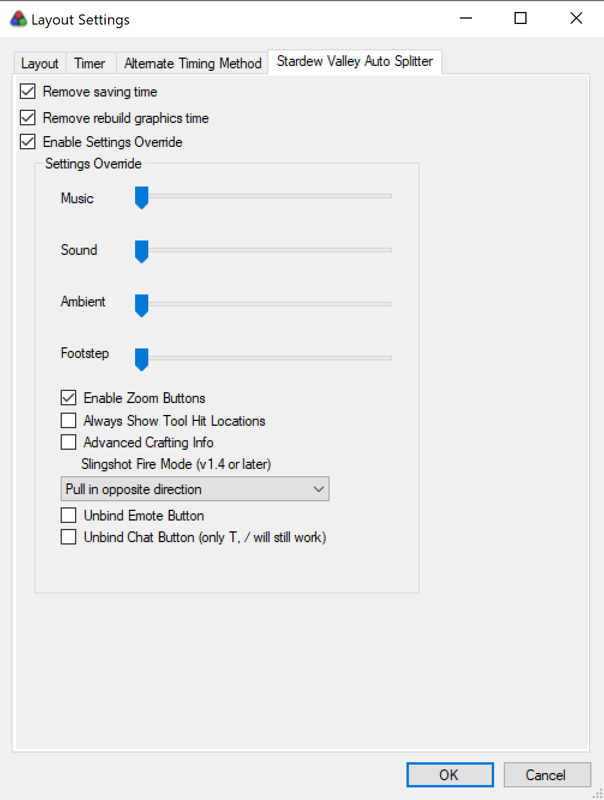

# Load Remover

Built by [Underscore76](https://github.com/Underscore76) and [BlueCheetah001](https://github.com/BlueCheetah001).

Major credit goes to BlueCheetah for building out the initial framework for this component/writing up the memory viewer. He made it super easy to add new version support.

Current support is for the following versions:

- 1.2.33
- 1.3.36
- 1.4.0
- 1.4.5
- 1.5.4

# Installing and using the Load Remover

## Adding the component to LiveSplit

First you'll need to setup LiveSplit to know you're playing Stardew Valley. Go ahead and edit your splits

Adding Stardew Valley into the "Game Name" field and it should auto-populate the load remover area. There you'll need to activate the component.

You can adjust the load remover settings here as well, see [here](#description-of-settings)

## Adding the AlternateTimingMethod component (optional but recommended)

A fairly nice way to show both real time and in-game time is to use the AlternateTimingMethod component listed on the LiveSplit components page. The release page to download it can be found [here](https://github.com/Dalet/LiveSplit.AlternateTimingMethod/releases).

Extract the dll file and add it to the `Components/` folder in your LiveSplit directory.

Then go to edit your layout:

And add the component to your layout:

Which will look something like this (it will toggle the alternate timing method to what you define in the `Compare Against` menu)

To swap you can change it via the `Compare Against` menu:

# Description of Settings

What are removed:

- `Remove /pause time` - should remove time when starting game paused from mp
- `Remove saving time` - should remove most large loading times, some may not be keyed fully as there is no direct trigger to identify.
- `Remove rebuild graphics time` - relevant to WSC, should remove the OS-controlled time due to swapping from windowed to fullscreen.

Here you can also override some in game settings for new file creation:

- `Music/Sound/Ambient/Footstep` - override the volume sliders in-game on file creation. If you adjust after that your in-game changes will take over. (`OUTRAGEOUSLY LOUD` by default)
- `Enable Zoom Buttons` - show the buttons (`off` by default)
- `Always Show Tool Hit Locations` - draw a red square around your hit location (`off` by default)
- `Advanced Crafting Info` (available in 1.4+) - show extra details about crafting (`off` by default)
- `Slingshot Mode` (available in 1.4+) - adjust how your slingshot works (`Pull in opposite direction` by default)
- `Unbind Emote Button` (available in 1.4+) - unbind the `Y` key from opening the emote menu
- `Unbind Chat Button` (available in 1.3+) - unbind the `T` key from opening the chat menu (`/` still works)

---

And that's it, if you have questions please reach out on the Stardew Speedrun Discord ([https://discord.gg/2zsuVzjAhN](https://discord.gg/2zsuVzjAhN))
