# WineskinServer for Blade's MapPredictor

Need to remember how to navigate to saves? Go [here](#navigation-to-saves)

# Needs before we get started
* Homebrew (open a terminal and type `brew` to see if you have it)
    * Homebrew is a package manager for MacOS, which we'll be using to install WineServer
    * Can be found at [https://brew.sh/](https://brew.sh/)
* Blade's Map Predictor (download from [Nexus](https://www.nexusmods.com/stardewvalley/mods/6614))

# Step 1: Install WineServer
1. Open a terminal
2. Type `brew install --cask --no-quarantine gcenx/wine/wineskin`
3. Wait for the installation to finish

# Step 2: Install a Wineskin Engine

When you try to launch `Wineskin Winery.app` for the first time, you will get a warning that it's from an unidentified developer. From the Wineskin Wiki:
> The program is not co-signed, to launch it you can RMB (right mouse button) it and select Open, then Cancel, then again RMB it and select Open, and Open.

You should be able to find it by navigating to your Applications folder directly.

1. Open `Wineskin Winery.app`

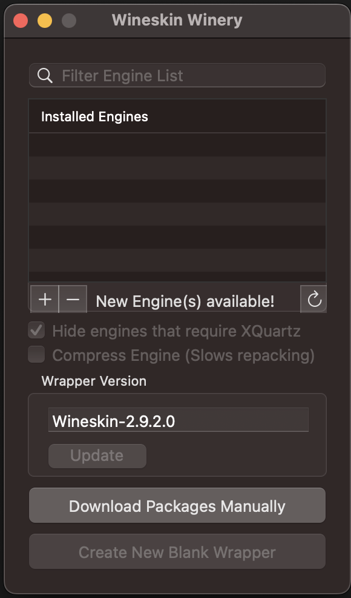

2. Click the `+` button to add a new engine

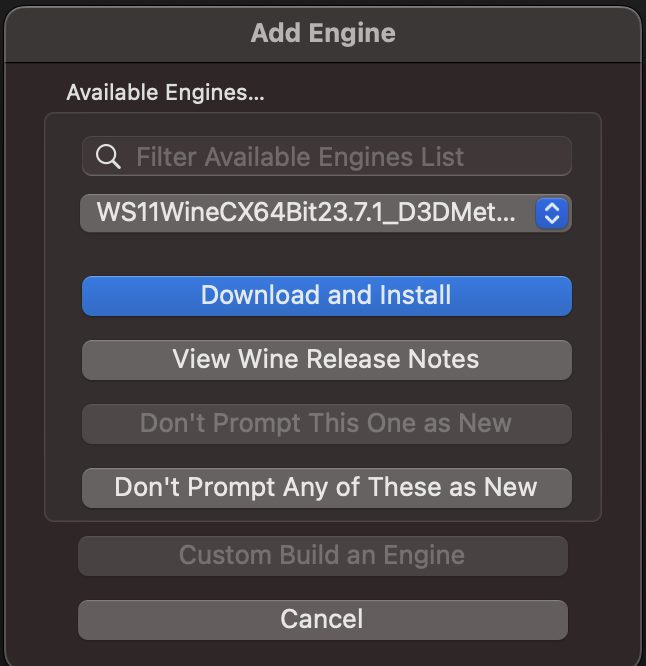

3. Select the latest engine and click `Download and Install` (I use the D3D Metal version, I'm on a M2 Mac, if you're on Intel it might have slightly different engine names). **UPDATE:** Trying it on 07/30/2025, the latest engine for me is "WS12WineCX24.0.7_3" and that worked just fine.

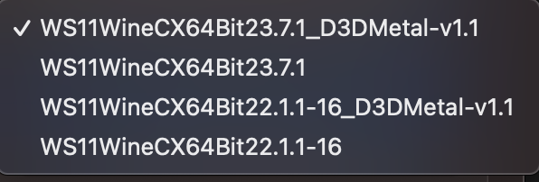

4. You'll get a prompt to install the engine, click `OK`

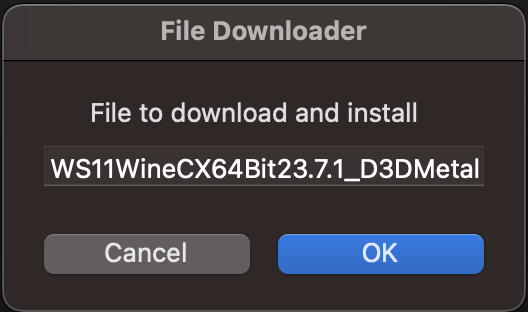

5. Wait for the engine to download and install

# Step 3: Create a new Wineskin Wrapper

1. Click `Create New Blank Wrapper`

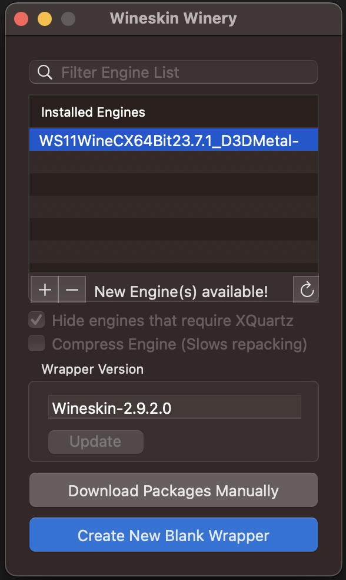

2. Name your wrapper (I named mine `BladesPredictor`) and click OK.

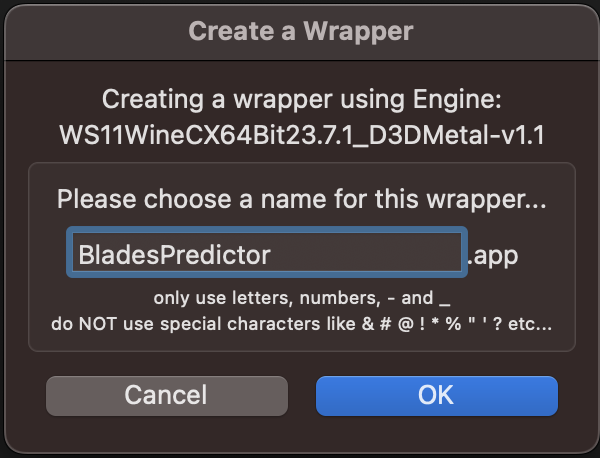

This may take a moment to create the wrapper (it might feel likes it has crashed but just wait it out). You'll find it at `/Users/<yourusername>/Applications/Wineskin` 

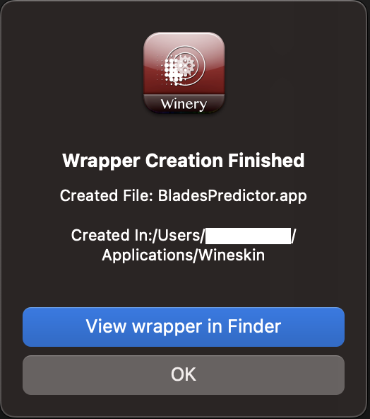

3. Click `View Wrapper in Finder` to open the folder and then double click the wrapper to open it.

# Step 4: Install Map Predictor in the Wrapper

When opening the wrapper, you should see a window like this:

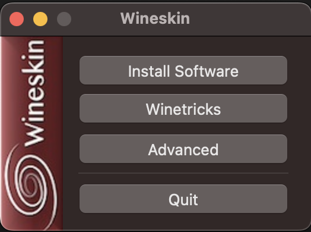

1. Click `Install Software`

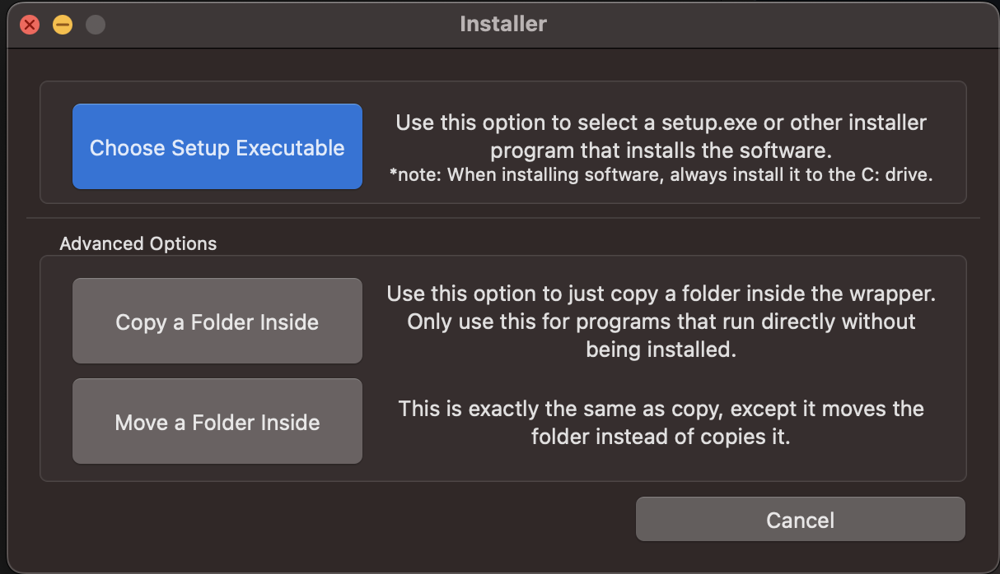

2. Click `Copy a Folder Inside` and navigate to the folder where you downloaded/unzipped Blade's Map Predictor. Select Choose

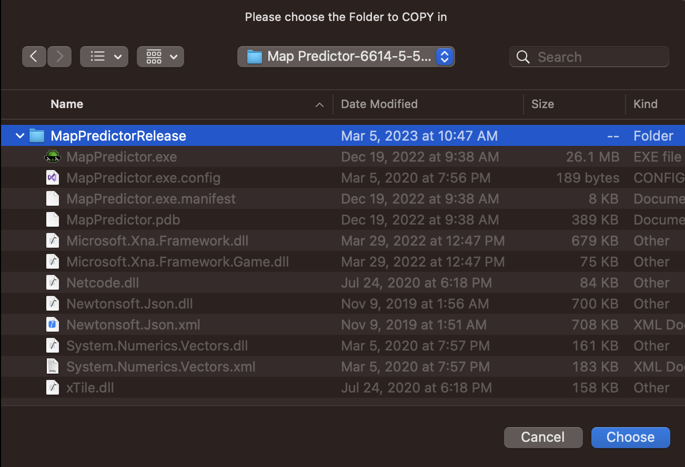

3. It'll prompt you to select the executable to use when you launch the app, for me at least it auto-detected the correct one but it should be the `MapPredictor.exe`.

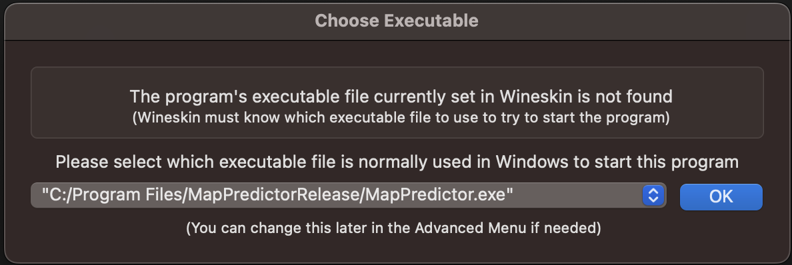

4. Click `OK` and then you'll come to an advanced settings screen. You can leave this as is and click `Install`

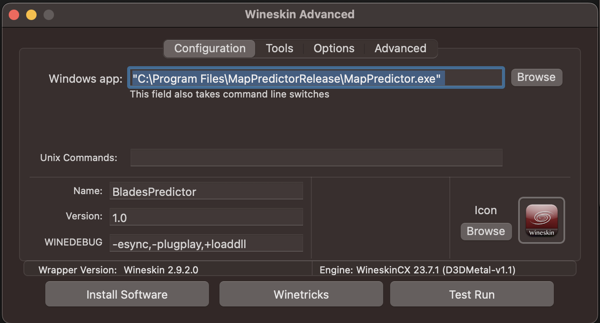

You can swap the app icon if you want (provided one here: [images/mappredictor/Wineskin.icns](images/mappredictor/Wineskin.icns))

**BEFORE LEAVING THIS SCREEN:** Click `Test Run` this will fail on the first run, as it will prompt you to install the .NET SDK.

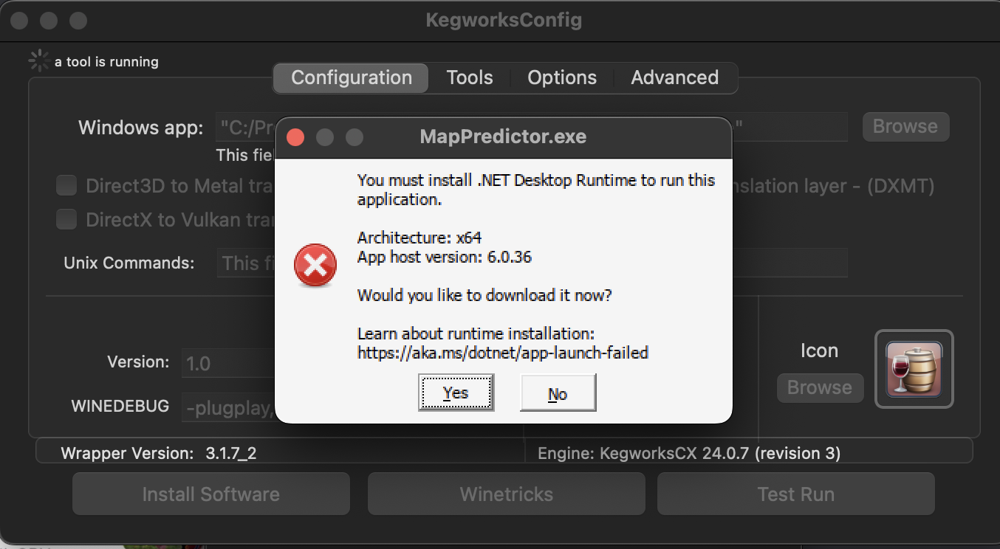

Click Yes, which will open a web browser and start the download of the windows version of the .NET SDK.

You'll also get a prompt that the test run was a success, you can ignore viewing the log.

5. Once the .NET SDK executable file is downloaded, click `Install Software` again in the Wineskin wrapper window. This time pick `Choose Setup Executable` and navigate to the .NET SDK executable you just downloaded. It may take a moment (on my first build it told me it failed but still worked anyways) and you should see the following install screen:

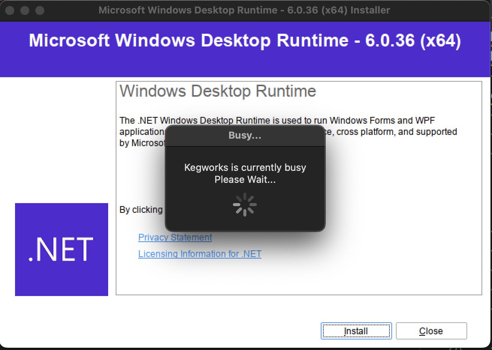

Click Install and wait for the process to finish. Then you can close out. 

At this point everything should be set up but I recommend doing another Test Run to ensure everything is working properly. If you get the Predictor window to open then you're all set!

Once you're satisfied it works you, you can close the window. The app icon might not update right away, but if you right click and Get Info it should update.

# Step 5: Running the app

1. Open the wrapper by double clicking it! You can add it to your dock if you want to have it handy/keep it in your Applications folder if you want to find it in launchpad. (I just spotlight search for it normally).

Blade's video guide for the Map Predictor can be found [here](https://www.youtube.com/watch?v=-ZqRYQcJseg).

# Navigation to Saves

When you attempt to `Open Save` you will need to fight a little bit to get to your saves. 

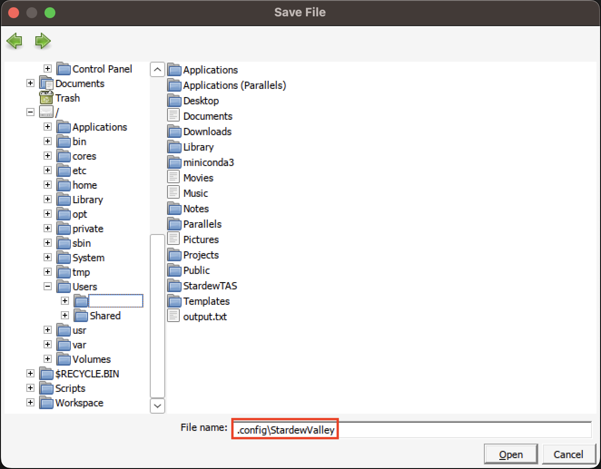

Scroll down to the `/` and then navigate to `Users` -> `yourusername`

Once you're here you can type `.config/StardewValley` in the file name box and hit enter. This will take you to the Stardew Valley saves folder on your Mac, where you can pick and choose a save to load. **Note: you will likely get prompted to provide access privileges multiple times as you drill down.**